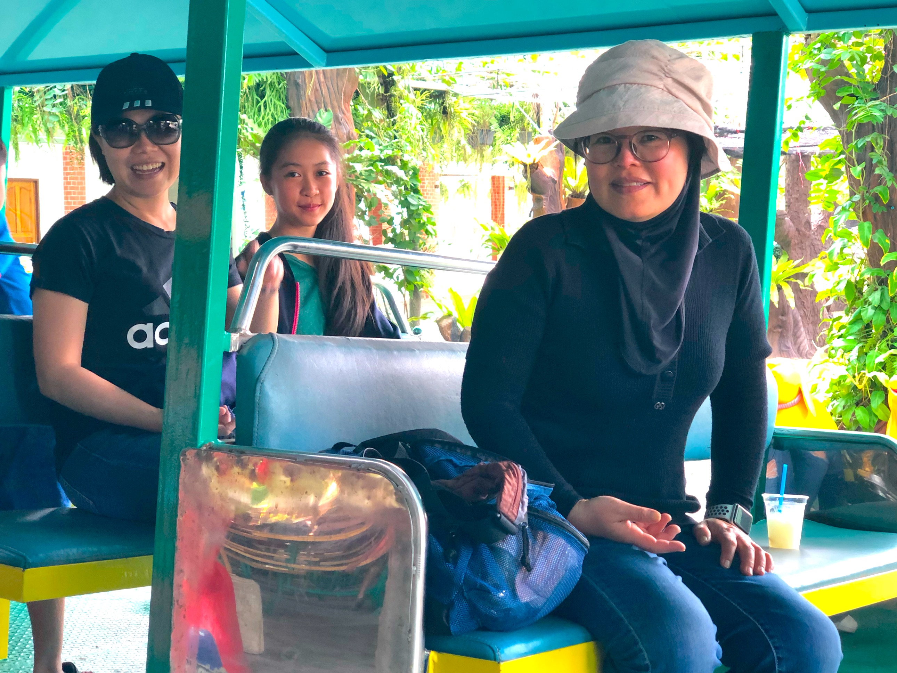

# suphattraland

<html lang="ja">
 <head>
  <meta charset="utf-8" />
 

<link href="https://cdnjs.cloudflare.com/ajax/libs/lightbox2/2.7.1/css/lightbox.css" rel="stylesheet">
 
</head>
<!--
<body onload="alert('ゴーさん、お疲れ様でした。またやりましょう！')" onunload="alert('再会の時まで、元気でお過ごしくださいませ〜(^o^)/')">
-->
                             

背景は85当時をイメージしたVサイン！

<h1><marquee behavior="lrft">!!! 2019年3月8日(金)に’８５研友会、郷田さんのご卒業記念パーティーが執り行われました !!!</marquee></h1>

<marquee direction="right" scrollamount="20" width="30%">(^_^)/~hada</marquee>

  ← アクセス用QRコード

<h3>↓ 2019年3月8日、Goさんご卒業パーティー、画像はクリックで拡大します。スライドショーで閲覧できます。</h3>

                          

                          

<!-- フッタ -->
 <footer>
 Copyright 2019/03/08 S.Hada
</footer>

まほろば地図

<iframe src="https://www.google.com/maps/embed?pb=!1m10!1m8!1m3!1d3613.6261617544483!2d140.1364481031006!3d36.765441082837135!3m2!1i1024!2i768!4f13.1!5e0!3m2!1sja!2sjp!4v1527029841980" width="600" height="450" frameborder="0" style="border:0" allowfullscreen></iframe>      
